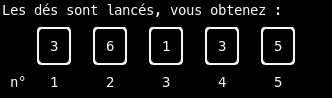
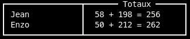

# Jeu du YAMS

Premier projet durant ma formation en BUT Informatique, cette application jouable dans un terminal permet à deux joueurs de se défier sur une partie de Yams.

## Règles du jeu

Le but du jeu est de gagner le plus de points possibles en faisant des combinaisons à l'aide de 5 dés. À chaque tour, le joueur dispose d'un maximum de 3 lancers pour faire une combinaison. Il peut relancer tout ou une partie des dés. Une fois les lancers terminés, ou s'il souhaite terminer son tour avant, le joueur note sur sa fiche les points qu'il obtient.

### Combinaisons

Il existe deux types de **combinaisons** : les sommes de points et les combinaisons spéciales. Une somme de points consiste à additionner les dés ayant les mêmes points *(par exemple, la somme des dés valant 1)*. Les combinaisons spéciales sont des motifs particuliers, et sont au nombre de 7 :

| Combinaison | Condition | Points |
| - | - | - |
| Brelan | 3 dés identiques | Somme des 5 dés |
| Carré | 4 dés identiques | Somme des 5 dés |
| Yams | 5 dés identiques | 50 points |
| Full House | Brelan et pair *(ex : 4, 4, 4, 3, 3)* | 25 points |
| Petite Suite | 4 dés formant une suite numérique *(ex : 1, 2, 3, 4)* | 30 points |
| Grande suite | 5 dés formant une suite numérique *(ex : 1, 2, 3, 4, 5)* | 40 points |
| Chance | *Aucune* | Somme des 5 dés |

Il est important de noter qu'une combinaison ne **peut être jouée qu'une seule fois** et ne peut pas être réutilisée par la suite. Le jeu repose donc à la fois sur de la chance et de la stratégie

> Chaque joueur **doit choisir une combinaison** à chaque tour, quand bien même elle ne lui rapporte aucun point
### Fin du jeu
Le jeu se termine après 13 tours, quand chaque joueur a rempli chaque case. Le gagnant est celui ayant accumulé le plus de points


## Rendu

Le jeu est entièrement programmé en C. La documentation est automatiquement générée à l'aide de [Doxygen](https://www.doxygen.nl/index.html)

### Lancer le jeu

Il est nécessaire d'avoir un terminal et un compilateur C installé. Sous Linux, avec GCC :

```bash
gcc -o yams source.c
./yams
```

### Générer la documentation

La configuration de la documentation se trouve dans [le fichier doxygen.conf](doxygen.conf). Doxygen est configuré pour générer la documentation en HTML et au format RTF, et est optimisé pour la documentation de code C. Les résultats sont stockés dans un dossier `docs`. Sous Linux, après avoir installé Doxygen :

```
mkdir -p docs
doxygen doxygen.conf
```

## Captures d'écran
### Feuille de score vide


### Feuille de score pleine


### Dés


### Combinaisons


### Résultat
